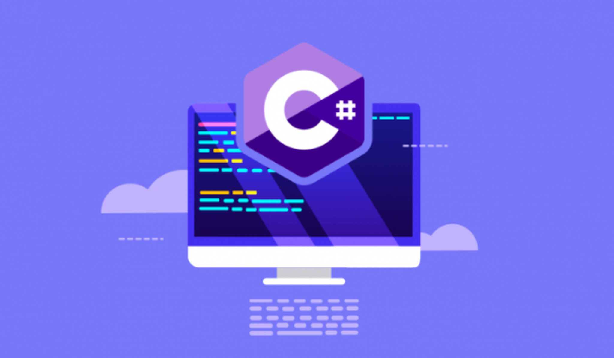

# C#:  FundamentosProgramacionEOI

## Historia:

Sus orígenes empiezan con Andrés Hejlsberg, creador de lenguajes como Turbo Pascal y Delphi que decidió formar un equipo de trabajo en 1999 para crear un nuevo lenguaje de programación, que hoy conocemos como C#. Durante el desarrollo del .NET Framework, sus bibliotecas de clases fueron escritas mediante un compilador de código administrado denominado Simple Managed C (SMC). Su nombre inicial fue Cool (C-like Object Oriented Language). Microsoft quiso mantener dicho nombre como definitivo pero por razones de registro de marca tuvo que echarse para atrás.

En julio de 2000, durante la Professional Developers Conference, el lenguaje había sido renombrado a C# y todas las librerías de clases y el runtime de ASP.NET fueron portadas a C#. Los creadores del lenguaje Java decían que C# era un clon de Java sin ninguna novedad ni innovación a lo que Anders Hejlsberg contestó que «C# es ‘no un clon de Java’ y es mucho más cercano a C++ en su diseño». 

Desde el lanzamiento de C# 2.0 en noviembre de 2005, los lenguajes C# y lenguajes Java han evolucionado en trayectorias cada vez más divergentes, convirtiéndose en algo menos similares el uno del otro. Una de las primeras diferencias principales vino con la adición de los genéricos en ambos lenguajes, con implementaciones muy diferentes. 

Muchas de sus características fueron evolucionando y mejorando hasta llegar a la versión actual. Por ejemplo, ahora el lenguaje de C# admite los conceptos de encapsulación, herencia y polimorfismo y facilita el desarrollo de componentes de software mediante varias construcciones de lenguaje innovadoras.

## Compilado, Interpretado o Híbrido

C# es un lenguaje de programación compilado, este se compila en un lenguaje intermedio IL en función de la especificación CLI. Una vez se ejecuta C#, este se carga en el CLR el cual tomará diferentes decisiones en función de la información y una vez cumplidos los requisitos de seguridad este realiza una compilación Just In Time del código para transformarle en el lenguaje nativo de la máquina host.

La compilación le otorga a C# una mayor velocidad, un mayor volumen de tamaño del conjunto de trabajo y protege el código de alteraciones no permitidas.

## Palabras clave

En C# existen las siguientes palabras clave: abstract, as, base, bool, break, byte, case, catch,  char, checked, class, const, continue, decimal, default, delegate, do, double, else, enum, event, explicit, extern, false, finally, fixed, float, for, foreach, goto, if, implicit, in, int, interface, internal, is, lock, long, namespace, new, null, object, operator, out, override, params, private, protected, public, readonly, ref, return, sbyte, sealed, short, sizeof, stackalloc, static, string, struct, switch, this, throw, true, try, typeof, uint, ulong, unchecked, unsafe, ushort, using, virtual, void, volatile, while.

Al mismo tiempo también existen palabras contextuales para darle un significado específico al código: add, and, alias, ascending, args, async, await, by, descending, Dynamic, equals, from, get, global, group, init, into, join, let, managed, nameof, nint, not, notnull, nuint, on, or, orderby, partial, partial, record, remove, select, set, unmanaged, unmanaged, value, var, when, where, where, con, yield.

### Palabras clave de instrucciones

**Instrucciones de selección**

* If: ejecuta una expresión o cuerpo si una expresión booleana cumple la condición de verdadera.

* Switch: selecciona una instrucción de una lista y la ejecuta en función de la coincidencia de un patrón con una expresión de coincidencia.

**Instrucciones de iteración**

* Do: ejecuta una instrucción siempre que una expresión booleana sea verdadera. Un bucle do se ejecuta una o varias veces.

* For: ejecuta una instrucción o bloque de instrucciones siempre que una expresión booleana se evalue como true.

* Foreach: ejecuta instrucciones para cada elemento de una instancia System.Collections.IEnumerable o System.Collections.Generic.IEnumerable<T>; aunque también puede realizarlo con otro tipo de instancias siempre que cumplan una serie de condiciones.

* While: ejecuta una instrucción siempre que una expresión booleana se evalúe como true. A diferencia de do, un bucle while se ejecuta cero o varias veces.

**Instrucciones de salto:**

* Break: detiene y finaliza la instrucción de interacción más próxima para a continuación transferir el control a la siguiente instrucción.

* Continue: la ejecución de esta instrucción comienza una nueva interacción de los bucles de instrucción de iteración más próximos.

* Goto: transfiere el control de una instrucción a otra marcada por una etiqueta mencionada en la misma instrucción.

* Return: esta instrucción finaliza la ejecución de la función y otorga de nuevo el control y el resultado de la función al llamador.

**Instrucciones para el control de excepciones**

* Throw: muestra la existencia de una excepción durante la ejecución del programa.

* Try-catch: indica el uso de controladores para distintas excepciones mediante el uso de try y catch.

* Try-finally: con el uso de finally se limpian todos los recursos asignados de un boque y ejecutar el código una vez el control abandona la instrucción try, aunque exista una excepción en este último bloque.

* Try-catch-finally: el uso conjunto de estas instrucciones se realiza para obtener y usar recursos del bloque try, lidiar con las excepciones del bloque catch y liberar recursos del bloque finally.

**Checked y unchecked**

* Checked: habilita la comprobación del desbordamiento para conversiones integrales y operaciones aritméticas.

* Unchecked: elimina la comprobación del desbordamiento para conversiones integrales y operaciones aritméticas de tipos enteros.

**Instrucción fixed**

* Fixed: impide que se reubique una variable móvil.

**lock (Instrucción)**

* Lock: obtiene el bloqueo de exclusión mutua de un objeto, ejecuta un bloque de instrucciones y posteriormente libera el bloqueo.

**Instrucción yield**

* Yield: muestra que el método, operador o descriptor de acceso get en el que aparece es un iterador.

## Sensible a la mayuscula y minuscula

C# distingue entre mayúsculas y minúsculas, ya que toma los lenguajes de estilo C que son sensibles a mayúsculas y minúsculas. Eso hace con que el código sea más legible, mediante el uso de convenciones de nomenclatura, e incluso sin las convenciones de nomenclatura, la coherencia impuesta por la distinción entre mayúsculas y minúsculas garantiza que la misma entidad siempre se escriba de la misma manera.

## Salario

Tras realizar una investigación online en diferentes plataformas como Infojobs, Glassdoor, Indeed y distintas ofertas públicas, se ha podido comprobar como la franja salarial media de un programador de C# en España se sitúa entre los 24.000€ y 36.000€ anuales, siendo el salario medio de 29.048€ anuales.

## Comunidad

Actualmente C# se sitúa como el quinto lenguaje de programación con mayor comunidad por debajo de otros como (Javascript, Python, Java, C/C++) y cuenta con una comunidad conformada por 6,5 millones de personas, un rating del 6,82% y un aumento del 1,91% (Tiobe Abril de 2022).

Ese puesto e importancia se debe que C# es un lenguaje clave para dispositivos pequeños, pero que son esenciales para el rendimiento. Adicionalmente, este es fácil de aprender y existe un compilador para cada procesador.

C# se ha encontrado siempre entre los 5 lenguajes de programación con mayor comunidad, alcanzado su mayor popularidad entre los años 1992 y 2001, época en la cual fue el lenguaje de programación más popular después de C (Tiobe Index).

Dentro de la comunidad de programación este se encuentra entre los lenguajes más amados, ocupando el décimo lugar con un 67% de respaldo, pero al mismo tiempo se encuentra también entre los lenguajes de programación más odiados situándose en el decimoctavo lugar con un 33% de impopularidad (Tiobe Index).

En el apartado de los lenguajes de programación más deseados, C# se encuentra en onceavo lugar con un 7% de popularidad (Tiobe Index). Esta popularidad existe gracias al respaldo de los desarrolladores de .NET y a la estandarización llevada a cabo por Microsoft.

Los datos mencionados anteriormente han sido proporcionados por los estudios llevados a cabo por Tiobe, los cuales se ven respaldados por otra de las instituciones más prestigiosas en este tipo de estudios, Developer Nation. Esta sitúa a C# como el sexto lenguaje de programación más popular en el Q3 de 2021, con una comunidad conformada por 7,1 millones de personas y con un crecimiento de 600.000 usuarios entre el Q1 y el Q3 del mismo año.

Esta misma institución destaca que C# es muy popular en AR/VR, aplicaciones de escritorio y juegos, mientras es menos popular en DS/ML y aplicaciones móviles.

El mayor foro online de este lenguaje de programación es .NET el cual está soportado por Microsoft. A través de este foro se resuelven dudas, se comparten tips, se realizan foros y encuentros y se ayuda a realizar una mejora continua.

Los mayores encuentros y conferencias de este lenguaje son NDC confereces, Microsoft Build, dotnetConf, VS Live and Devintersection.

## Influencia de otro lenguaje

C# tiene sus raíces en la familia de lenguajes C, ha sido influido principalmente por Java, C++, Eiffel, Modula-3 y Pascal. También, ha sido influido por el lenguaje de Oracle, y esa influencia se nota sobre todo en el paradigma funcional (según Java reinventado en su versión 8). Finalmente podemos afirmar que además a los programadores de JavaScript, C# les resultará familiar inmediatamente.

## Multiplataforma: Windows, Linux o IOs

El lenguaje C# tiene un gran alcance y es compilado por los tres sistemas operativos (Windows, Linux e IOS) pero con el uso de ciertas librerías. Por lo tanto, las limitaciones existen, mejor dicho, en los entornos de desarrollos proveídos, mientras no se tengan las herramientas que existen en Windows y la capacidad de despliegue que tenemos usando IIS en server Windows también, en otras plataformas, el uso del lenguaje seguirá siendo mayor en su plataforma nativa. Actualmente Microsoft está trabajando para resolver esto. 

Más específicamente, C# es un lenguaje concebido para Microsoft Windows y por supuesto en su sistema operativo, funciona perfecto, todo lo que necesitas para hacer aplicaciones de todo tipo, web de escritorio y móviles está incluido en el .NET framework. Microsoft está haciendo un trabajo gigantesco con .NET Core para que sus herramientas y lenguajes sean multiplataforma.

Por otro lado, en MacOS tenemos el IDE Visual Studio, y es muy potente contrario a lo que se podría creer. Sin problemas puedes crear una aplicación web en una máquina Windows y después seguir su desarrollo en una Mac, aunque se pueden presentar algunos problemas con ciertas librerías, con el framework .NET tradicional. Si lo haces en Core no debería de presentarse ningún problema. En MacOS también se pueden desarrollar aplicaciones de consola usando .NET, y aplicaciones móviles usando Xamarin. Pero las aplicaciones de escritorio no, ya que estás hacen target a Windows.

Finalmente, en Linux para el desarrollo existe la plataforma MONO, pero no es el equivalente de un Visual Studio, ignorando si se puedan desarrollar todo tipo de aplicaciones, pero el entorno está pensado para el .NET Framework tradicional.Para el desarrollo en .NET Core se utilizan otro tipo de herramientas y procedimientos.
